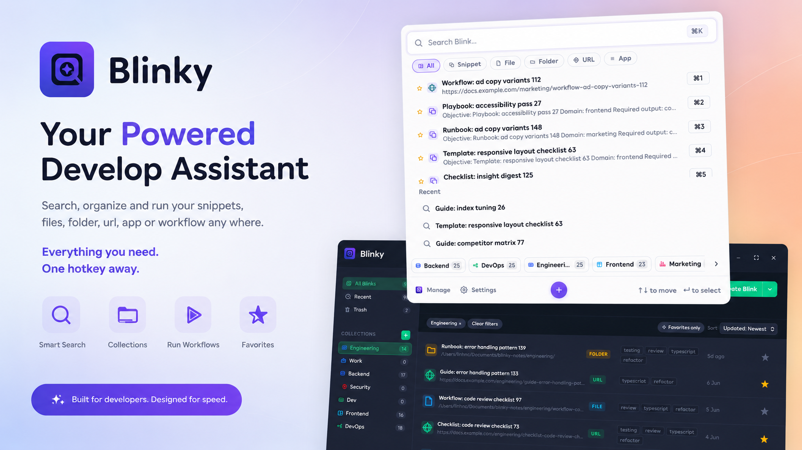
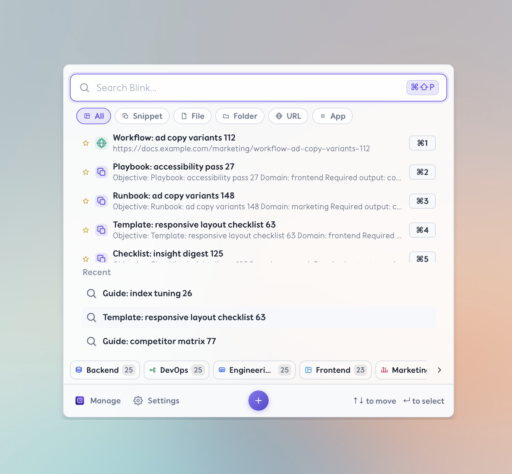
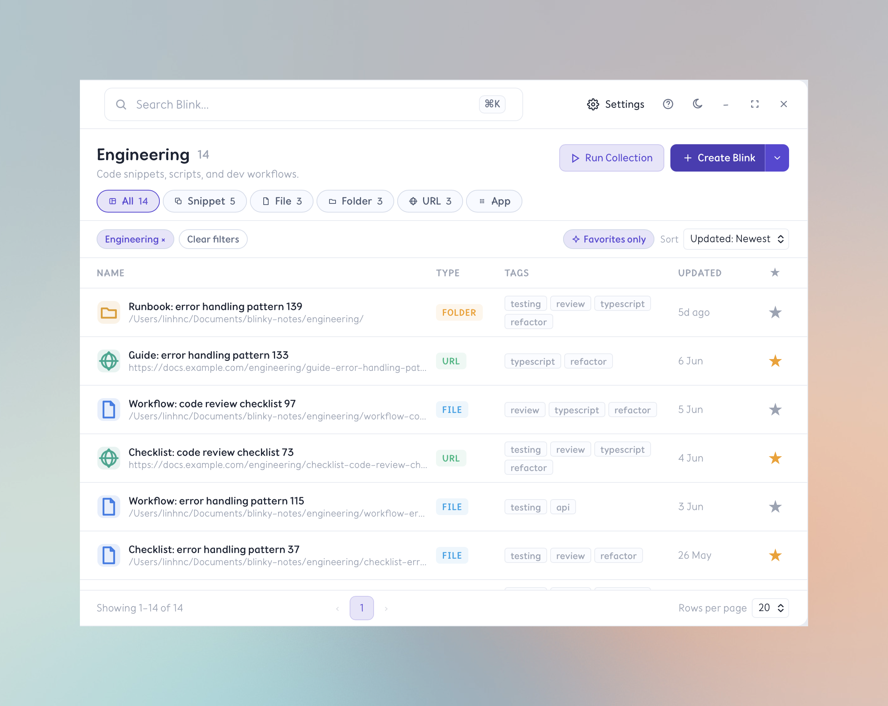
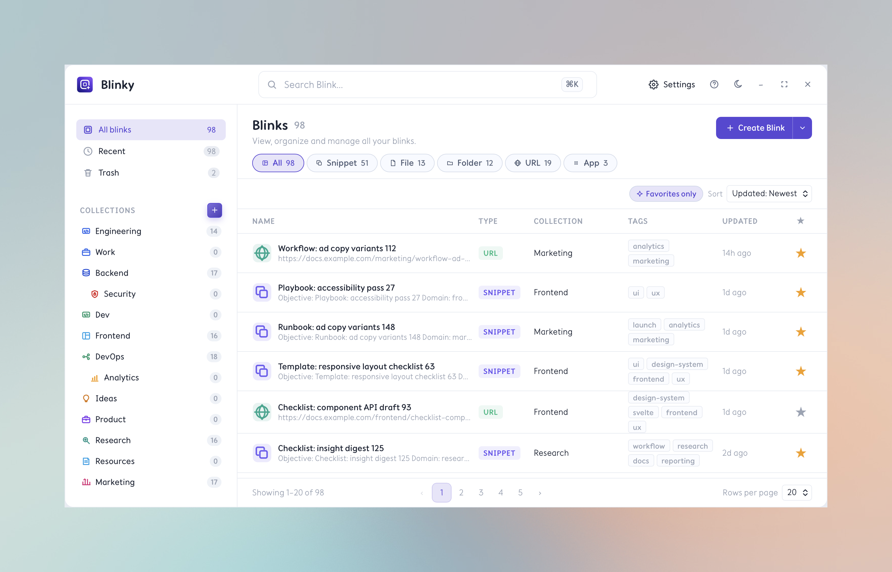
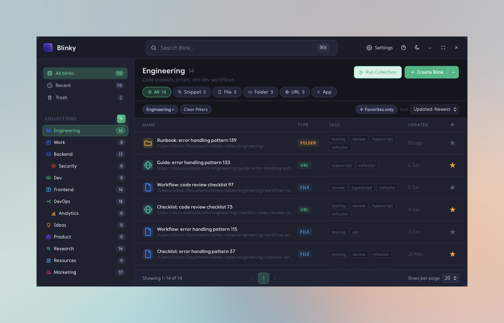

  

  <h1>Blinky | OneZ</h1>

  
<strong>Everything one hotkey away.</strong> 
  Instantly search your snippets, files, folders, URLs, apps, and workflows — from any application, without ever leaving the keyboard.

  

    <a href="https://blinky.onez.app#download">Download Free</a> ·
    <a href="https://blinky.onez.app">Website</a> ·
    <a href="#features">Features</a> ·
    <a href="#pricing">Pricing</a>
  

  

---

## What is Blinky?

**Blinky** is a global hotkey quick panel for macOS, Windows, and Linux that puts everything you work with one keystroke away. Press `⌘⇧P` (or `Ctrl+Alt+P` on Windows/Linux) from *any* application to instantly surface a fast launcher — no mouse, no alt-tab, no lost focus.

Blinks are the core primitive: five composable types (snippets, files, folders, URLs, apps) that slot into Collections and multi-step workflows. Whether you're a developer running build scripts, a writer pasting boilerplate, or a designer jumping between tools, Blinky keeps you in flow.

> **Speed is the product.** Every feature is designed to remove friction, not add it.

---

## Press Anytime. Access Everything.

  

One hotkey. Every app. Any moment.

Blinky lives silently in the background until you need it. Press the global hotkey from a full-screen app, a video call, or a terminal — the Quick Panel appears instantly, ready for your query. No window management. No context switch. Just your cursor and a result in milliseconds.

**What you can access in a single keystroke:**

| Blink Type | What it does |
|---|---|
| **Snippet** | Paste text, code, or templates instantly into any field |
| **File / Folder** | Open, reveal, or copy paths to any local item |
| **URL** | Launch bookmarks, dashboards, and deep links |
| **App** | Switch to or launch any installed application |
| **Workflow** | Run a sequence of multiple actions in one step |

---

## Organize into Collections. Jump into Context Instantly.

  

Group your Blinks into named **Collections** by project, context, or workflow. Jump into a context instantly — and run an entire Collection at once.

Working on a client project? One Collection holds the folder, the staging URL, the Slack channel, and the deploy command. Switch contexts by switching Collections. Run all items in a Collection with a single action — no setup, no repetition.

- **Named Collections** — organize by project, client, workflow, or anything you choose
- **Run all** — trigger every Blink in a Collection in sequence with one command
- **Instant switching** — jump from one context to another without breaking flow

---

## Features

  

### Core
- **Global hotkey** — `⌘⇧P` / `Ctrl+Alt+P` from any application
- **Quick Panel** — fast, keyboard-driven launcher that appears in under 100 ms
- **5 Blink types** — Snippets, Files, Folders, URLs, Apps
- **Basic search** — fuzzy find anything you've saved
- **Run all in Collection** — execute an entire workflow in one step

### Premium & Ultimate
- **Unlimited Blinks** — no cap on how much you save
- **Unlimited Collections** — organize without limits
- **Dark mode and themes** — match your setup and reduce eye strain
- **Import / Export** — back up, migrate, or share your Blinks
- **Multi-device license** — Ultimate covers up to 5 machines
- **Priority support** — direct line to the team

  

---

## Pricing

| Plan | Price | Blinks | Collections | Devices |
|---|---|---|---|---|
| **Free** | $0 forever | Up to 20 | 3 | 1 |
| **Premium** | $29 one-time | Unlimited | Unlimited | 1 |
| **Ultimate** | $69 one-time | Unlimited | Unlimited | 5 |

All purchases are **one-time** — no subscription, no renewal, no surprises.

---

## Who is Blinky for?

Blinky is for anyone who spends hours at a keyboard and wants to move faster:

- **Developers** — run scripts, open repos, paste boilerplate, switch projects
- **Designers** — jump between files, launch tools, open reference URLs
- **Writers** — insert templates, open research folders, paste repeated phrases
- **Students** — access notes, launch apps, navigate between resources
- **Anyone on macOS, Windows, or Linux** who is tired of reaching for the mouse

---

## Getting Started

1. [Download Blinky](https://blinky.onez.app#download) — free, no credit card required
2. Install and launch — Blinky lives in your menu bar / system tray
3. Press `⌘⇧P` (macOS) or `Ctrl+Alt+P` (Windows/Linux)
4. Create your first Blink and add it to a Collection
5. Set your global hotkey and never leave the keyboard again

---

## Keywords

`hotkey launcher` · `snippet manager` · `keyboard productivity` · `quick launcher macOS` · `workflow automation` · `file launcher` · `URL launcher` · `app switcher` · `productivity tool` · `Alfred alternative` · `Raycast alternative` · `keyboard shortcut manager`

---

## Links

- **Website:** [blinky.app](https://blinky.onez.app)
- **Download:** [blinky.app/download](https://blinky.onez.app#download)
- **Support:** hi@onez.app
- **Features:** [Collections](https://blinky.onez.app/features/collections) · [Dark Mode & Themes](https://blinky.onez.app/features/dark-mode-themes) · [Open Library](https://blinky.onez.app/features/open-library) · [Search & Launch](https://blinky.onez.app/features/search-launch)

---

  Built for people who live at the keyboard. Fast. Powerful. Simple.

